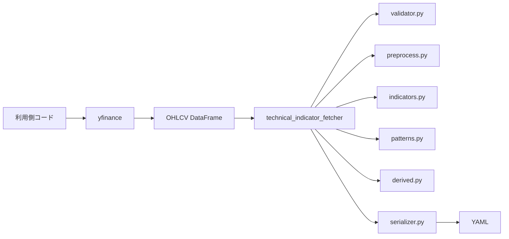
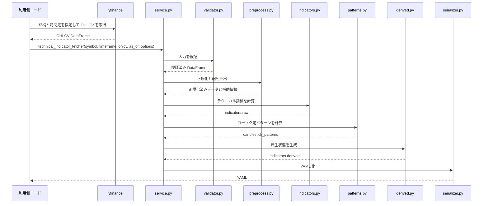
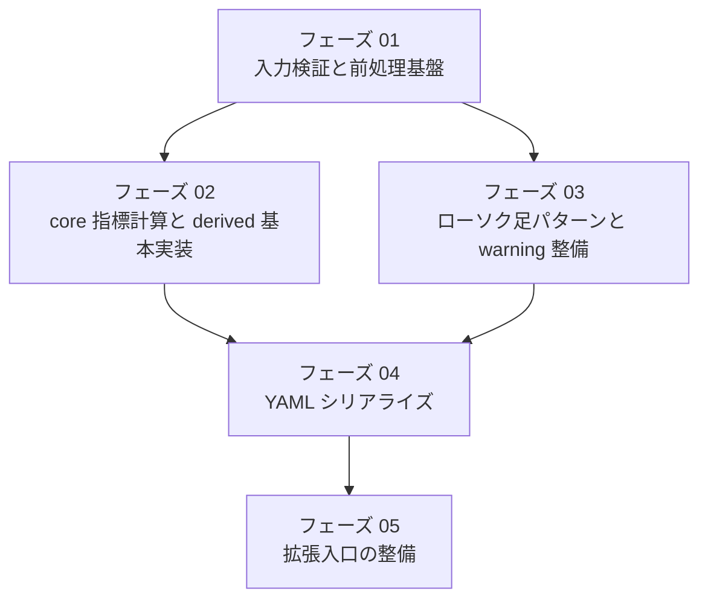

# TechnicalIndicatorFetcher

## これは何か

このプロジェクトは、株価などの OHLCV データを受け取り、主要なテクニカル指標とローソク足パターンを計算して、上位エージェントがそのまま読みやすい YAML を返すための fetcher を実装するプロジェクトです。

この fetcher 自身は売買判断をしません。
役割は、判断しやすい材料をコード側で安定して作ることです。

## 何をしたいのか

OHLCV の生データをそのまま上位エージェントへ渡すと、毎回同じ計算や同じ解釈をやり直すことになります。
このプロジェクトでは、その前段で次を済ませます。

* テクニカル指標の計算
* ローソク足パターンの検出
* 最低限の機械判定の付与
* YAML への整形

## まず言葉の意味

門外漢だと詰まりやすい言葉を先に整理します。

* `OHLCV`
  `Open` `High` `Low` `Close` `Volume` の頭文字を並べた略語です。株価データの基本セットで、`Open` は始値、`High` は高値、`Low` は安値、`Close` は終値、`Volume` は出来高です
* `OHLC`
  `Open` `High` `Low` `Close` の頭文字を並べた略語です。`OHLCV` から出来高 `Volume` を除いたものです
* `OHLCV DataFrame`
  OHLCV を表形式で持ったデータです。1行が1本のローソク足、各列が `open` `high` `low` `close` `volume` だと思えば十分です
* 上位エージェント
  この fetcher の結果を受け取って、さらに解釈や判断を行う側の AI やプログラムです
* fetcher
  ここでは「必要な材料を集めて、使いやすい形に整えて返す部品」という意味で使っています
* `DataFrame`
  Python でよく使う表形式データです。Excel の表をコード上で扱うイメージに近いです
* `TA-Lib`
  OHLCV のような価格データを入力にして、RSI や MACD などのテクニカル指標や、ローソク足パターンを計算するためのライブラリです
* YAML
  インデントで構造を表すテキスト形式です。JSON より人が目で追いやすい用途でよく使います
* `derived`
  生の数値を、そのままでは分かりにくいので「above」「overbought」のような状態ラベルへ変えたものです
* warning
  処理は続けられるが、注意すべきことがあるという通知です。エラーとは違い、即停止を意味しません

## 何をしないのか

このプロジェクトは次を担当しません。

* 最終的な売買判断
* エントリー / イグジット判断
* ポジションサイズ計算
* 損切り / 利確価格の決定
* ニュース分析やファンダメンタル分析
* 複数銘柄のランキング
* バックテスト

## 全体像



## 処理の流れ



## 入力

最低限必要な入力は次です。

* `symbol`：銘柄識別子
* `timeframe`：時間足
* `ohlcv`：`open` `high` `low` `close` `volume` を持つ DataFrame
* `as_of`：どの時点まで反映したデータかを示す時刻

想定しているデータ取得元は `yfinance` です。
ただし、fetcher 自体は取得責務を持たず、外から OHLCV を受け取る形にします。

関係を一言で言うと、`yfinance` が OHLCV DataFrame を用意し、`TA-Lib` がその中の価格データを使って指標を計算します。

補足：

* `yfinance`
  Yahoo Finance から価格データを取得するための Python ライブラリです
* `as_of`
  「この出力はどの時点までのデータを使って作られたか」を示します

## 出力

主な出力は YAML です。
必要に応じて、YAML 化前の dict も返せる想定です。

返却内容は大きく次の4つです。

* `data_summary`：最新バーや使用本数などの要約
* `indicators.raw`：計算した生の指標値
* `indicators.derived`：生値を解釈しやすい状態ラベルへ変換したもの
* `candlestick_patterns` と `warnings`：パターン結果と注意事項

補足：

* dict
  Python のキーと値の組です。JSON オブジェクトに近いものです
* `raw`
  まだ解釈していない生の計算結果です
* `derived`
  `raw` を見て、機械的なルールで意味づけした結果です

イメージは次です。

```yaml
schema_version: "1.0"
generated_at: "2026-03-13T12:00:00+09:00"
symbol: "AAPL"
timeframe: "1d"
as_of: "2026-03-12"

data_summary:
  bars_used: 260
  latest_close: 212.34
  latest_volume: 55432100
  adjusted: true
  candle_status: "closed"

indicators:
  raw:
    sma_20: 208.11
    rsi_14: 63.8
  derived:
    trend:
      close_vs_sma20: "above"
    momentum:
      rsi_state: "neutral"

candlestick_patterns:
  latest_bar:
    cdl_engulfing:
      score: 100
      state: "bullish"
      detected_on_latest_bar: true
  recent_hits: []

warnings: []
```

## 出力例の見方

例に出てくる項目のうち、初見だと分かりにくいものを補足します。

* `bars_used`
  指標計算に使ったローソク足データの本数です
* `adjusted`
  株式分割や配当などを反映した価格を使ったかどうかです
* `candle_status`
  最新バーが確定済みか、まだ動いている途中かを示します
* `score`
  ローソク足パターン検出ライブラリが返す数値です。0 以外なら何らかのパターンが出たと見ます
* `state`
  `score` や各指標値を、強気、弱気、中立などの分かりやすい状態へ直したものです
* `warnings: []`
  空配列なら、少なくとも処理継続上の注意事項はなかったという意味です

## どのファイルが何をするか

実装予定の中心ファイルは次です。

| ファイル | 主な役割 | 何に対して何をするか |
|---|---|---|
| `service.py` | 全体制御 | `technical_indicator_fetcher(...)` が各モジュールを順番に呼び、最終結果を組み立てる |
| `validator.py` | 入力検証 | `ohlcv` に対して必須列、並び順、重複、欠損、型を確認する |
| `preprocess.py` | 前処理 | DataFrame を後続が扱いやすい形へ正規化し、配列や補助情報を作る |
| `indicators.py` | 指標計算 | OHLCV 配列に対して TA-Lib を使い、RSI や MACD などを計算して `indicators.raw` を作る |
| `patterns.py` | パターン検出 | OHLC 配列に対して TA-Lib を使い、ローソク足パターンを計算して `latest_bar` と `recent_hits` を作る |
| `derived.py` | 状態生成 | `indicators.raw` に対して判定ルールを適用し、`indicators.derived` を作る |
| `serializer.py` | YAML 化 | 組み立て済みの dict に対してコメント付与と順序固定を行い、YAML 文字列へ変換する |
| `config.py` | 設定保持 | 指標セット、パターンセット、閾値、window の既定値を持つ |
| `models.py` | データ構造 | options、warning、pattern hit などの構造を定義する |
| `exceptions.py` | 例外定義 | 検証失敗や計算失敗を識別しやすい例外として整理する |

補足：

* `TA-Lib`
  `indicators.py` では RSI や MACD などの指標計算に使い、`patterns.py` ではローソク足パターン検出に使います

## v1 で実装する範囲

まずは次に絞って作ります。

* 単一銘柄
* 単一時間足
* `core` 指標
* `major_only` パターン
* YAML 出力
* `derived` の最低限ルール
* `warnings`

補足：

* `core`
  v1 で必須にする基本指標セットです
* `major_only`
  v1 で必須にする主要なローソク足パターンだけを対象にする設定です

## v1 の実装フェーズ



## 人が見る時のポイント

このプロジェクトを読む時は、まず次の順で見ると把握しやすいです。

1. `service.py` が全体の流れをどうつなぐか
2. `validator.py` と `preprocess.py` が入力をどう整えるか
3. `indicators.py` と `patterns.py` が何を計算するか
4. `derived.py` がどんな判定ルールでラベル化するか
5. `serializer.py` が最終的にどんな YAML を返すか

## 現時点の前提

現時点では、実装前の仕様整理が進んでいる段階です。
詳細な要求、方針、選定、設計、計画は `MyDocs/開発/` 配下に整理されています。
