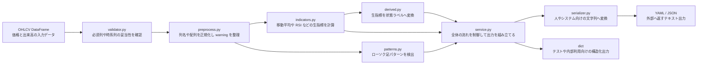
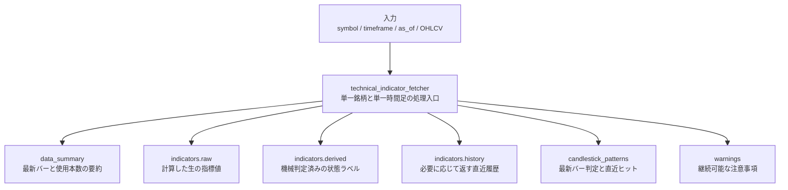
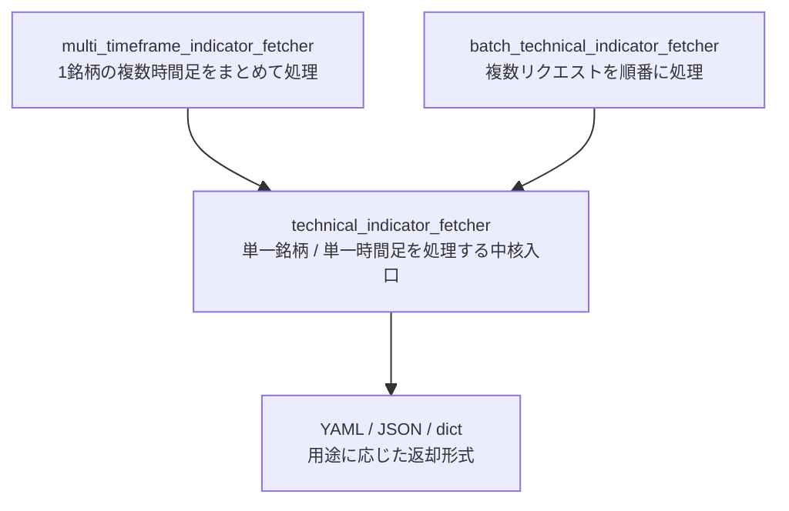

# TechnicalIndicatorFetcher

## これは何か

`TechnicalIndicatorFetcher` は、OHLCV データを受け取り、テクニカル指標、ローソク足パターン、最低限の機械判定をまとめて返す Python ライブラリです。

この fetcher 自身は売買判断をしません。
役割は、上位エージェントや人が読みやすい形で、分析材料を安定して作ることです。

現在は次に対応しています。

* 単一銘柄 / 単一時間足の計算
* `core` / `extended` 指標 profile
* `major_only` / `full` ローソク足パターン profile
* YAML / JSON / dict 出力
* `include_history`
* `strict` mode
* 単一銘柄の複数時間足集約
* 複数リクエストのバッチ実行

## 全体像



## 何をしないか

このプロジェクトは次を担当しません。

* 最終的な売買判断
* エントリー / イグジット判断
* ポジションサイズ計算
* 損切り / 利確価格の決定
* ニュース分析やファンダメンタル分析
* 複数銘柄のランキング
* バックテスト

## 入出力のイメージ

入力は `open` `high` `low` `close` `volume` を持つ `pandas.DataFrame` です。

出力は次の3通りです。

* YAML 文字列
* JSON 文字列
* dict

返却の中心構造は共通で、主に次を含みます。

* `data_summary`
* `indicators.raw`
* `indicators.derived`
* `indicators.history`
* `candlestick_patterns`
* `warnings`

YAML 出力では、人が見ても追いやすいように各項目の意味コメントを付けています。



## セットアップ

`uv` を使う前提なら、まず依存を同期します。

```bash
uv sync --group dev
```

テスト実行はこれです。

```bash
uv run pytest
```

## すぐ試す

リポジトリには実行用サンプル [`sample_run.py`](/home/osuim/Dev/TechnicalIndicatorFetcher/sample_run.py) があります。

YAML 出力：

```bash
uv run python sample_run.py
```

JSON 出力：

```bash
uv run python sample_run.py --format json
```

拡張指標と `full` パターン：

```bash
uv run python sample_run.py --format json --indicator-profile extended --pattern-profile full
```

## 使い方

最小例です。

```python
import pandas as pd

from technical_indicator_fetcher import FetcherOptions, technical_indicator_fetcher

df = pd.DataFrame(
    {
        "timestamp": pd.date_range("2025-01-01", periods=260, freq="D"),
        "open": [100 + i * 0.5 for i in range(260)],
        "high": [101 + i * 0.5 for i in range(260)],
        "low": [99 + i * 0.5 for i in range(260)],
        "close": [100.5 + i * 0.5 for i in range(260)],
        "volume": [1000 + i * 10 for i in range(260)],
    }
)

result = technical_indicator_fetcher(
    symbol="AAPL",
    timeframe="1d",
    ohlcv=df,
    as_of="2025-09-17",
    options=FetcherOptions(
        output_format="yaml",
        indicator_profile="core",
        pattern_profile="major_only",
    ),
)

print(result)
```

## 主要 API

3つの入口がありますが、計算の本体は単一銘柄 / 単一時間足の入口を中心にしています。



### 1. `technical_indicator_fetcher(...)`

単一銘柄 / 単一時間足の入口です。

```python
technical_indicator_fetcher(
    symbol: str,
    timeframe: str,
    ohlcv: pd.DataFrame,
    as_of: str | datetime,
    options: FetcherOptions | None = None,
    return_dict: bool = False,
) -> str | dict
```

### 2. `multi_timeframe_indicator_fetcher(...)`

単一銘柄に対して複数時間足をまとめて処理します。

```python
multi_timeframe_indicator_fetcher(
    symbol: str,
    ohlcv_by_timeframe: dict[str, pd.DataFrame],
    as_of: str | dict[str, str],
    options: FetcherOptions | dict[str, FetcherOptions] | None = None,
    return_dict: bool = False,
) -> dict[str, str | dict]
```

### 3. `batch_technical_indicator_fetcher(...)`

複数銘柄 / 複数時間足のリクエストを順番に処理します。

```python
batch_technical_indicator_fetcher(
    requests: list[BatchRequest],
    return_dict: bool = False,
) -> list[str | dict]
```

## `FetcherOptions` でよく使うもの

| 項目 | 値や例 | 何を決めるか |
|---|---|---|
| `output_format` | `yaml` / `json` | 文字列出力の形式を切り替える |
| `indicator_profile` | `core` / `extended` | どこまで指標を計算するかを切り替える |
| `pattern_profile` | `major_only` / `full` | どこまでローソク足パターンを返すかを切り替える |
| `include_history` | `True` / `False` | `indicators.history` を返すかどうかを決める |
| `emit_yaml_comments` | `True` / `False` | YAML に意味コメントを付けるかどうかを決める |
| `strict` | `True` / `False` | warning で継続せず、例外で止めるかどうかを決める |
| `lookback_bars` | 例：`10` | 履歴を返すときに何本分返すかを決める |
| `price_adjustment` | `True` / `False` | 調整後価格を前提に扱うかどうかを決める |
| `json_indent` | 例：`2` | JSON の見やすさ用インデント幅を決める |
| `pattern_recent_window` | 例：`10` | `recent_hits` を何本前まで見るかを決める |
| `minimum_bars` | 例：`200` | 最低限ほしいバー数の基準を決める |
| `recommended_bars` | 例：`260` | 推奨バー数の基準を決める |

`return_dict=True` を指定した場合は `output_format` より dict 返却が優先されます。

## 現在の指標とパターン

### `core` 指標

| 項目 | 何を見るものか |
|---|---|
| `sma_20` | 終値の20本単純移動平均。短期の基準線 |
| `sma_50` | 終値の50本単純移動平均。中期の基準線 |
| `sma_200` | 終値の200本単純移動平均。長期の基準線 |
| `ema_20` | 終値の20本指数移動平均。直近の値動きをやや強く反映 |
| `ema_50` | 終値の50本指数移動平均。中期の流れをやや敏感に見る |
| `macd` | 短期と中期の移動平均差から勢いの変化を見る |
| `adx_14` | トレンドの強さを見る。方向ではなく強弱を見る |
| `plus_di_14` | 上方向の勢いを見る |
| `minus_di_14` | 下方向の勢いを見る |
| `sar` | トレンド転換の目安を見る |
| `rsi_14` | 買われすぎ / 売られすぎの目安を見る |
| `stoch` | 直近レンジの中で終値がどこにいるかを見る |
| `willr_14` | 直近レンジの中で終値が高いか低いかを見る |
| `cci_20` | 平均からどれだけ価格が離れているかを見る |
| `roc_10` | 10本前と比べた価格変化率を見る |
| `atr_14` | 値幅の大きさを見る |
| `natr_14` | ATR を価格比で見て、銘柄差をならして値幅を見る |
| `bbands_20_2` | ボリンジャーバンド。価格の位置と広がりを見る |
| `obv` | 出来高が上昇方向か下落方向かに積み上がっているかを見る |
| `mfi_14` | 出来高込みで資金流入 / 流出感を見る |
| `ad` | 累積的な資金流入 / 流出を見る |
| `adosc` | A/D ラインの短期差で資金流入の勢いを見る |

### `extended` 指標

| 項目 | 何を見るものか |
|---|---|
| `aroon_25` | 高値 / 安値が最近いつ出たかからトレンド感を見る |
| `aroonosc_25` | `aroon_25` の up と down の差を見る |
| `ppo_12_26_9` | 移動平均差を比率で見て勢いの変化を見る |
| `trix_30` | ノイズをならした長めの勢い変化を見る |
| `kama_10` | 相場状況に応じて反応速度が変わる移動平均を見る |
| `linearreg_slope_14` | 線形回帰の傾きで価格の傾向を見る |
| `mom_10` | 10本前との差でシンプルな勢いを見る |
| `cmo_14` | 上昇幅と下落幅の偏りから勢いを見る |

### `major_only` パターン

| 項目 | 何を見るものか |
|---|---|
| `cdl_doji` | 始値と終値が近く、迷いが強い足 |
| `cdl_hammer` | 下ひげが長く、下落後の反発候補を見る足 |
| `cdl_inverted_hammer` | 上ひげが長く、下落後の反発候補を見る足 |
| `cdl_hanging_man` | 上昇後に出る下ひげ長めの注意足 |
| `cdl_shooting_star` | 上昇後に出る上ひげ長めの反落注意足 |
| `cdl_engulfing` | 前の足を包み込む反転候補パターン |
| `cdl_harami` | 前の大きい足の中に収まる反転候補パターン |
| `cdl_piercing` | 下落後に出る強気寄りの反転候補パターン |
| `cdl_dark_cloud_cover` | 上昇後に出る弱気寄りの反転候補パターン |
| `cdl_morning_star` | 下落後に出る3本構成の反転候補パターン |
| `cdl_evening_star` | 上昇後に出る3本構成の反転候補パターン |
| `cdl_3white_soldiers` | 連続陽線で上昇の強さを見るパターン |
| `cdl_3black_crows` | 連続陰線で下落の強さを見るパターン |

### `full` 追加分

| 項目 | 何を見るものか |
|---|---|
| `cdl_marubozu` | ひげが短く実体が大きい、強い一本調子の足 |
| `cdl_spinning_top` | 実体が小さく上下にひげがある、迷いの強い足 |
| `cdl_long_legged_doji` | 上下に長いひげを持つ十字足で迷いを見る |
| `cdl_belt_hold` | 寄り付きから一方向に強く進む足 |
| `cdl_kicking` | ギャップを伴う強い反転候補パターン |
| `cdl_takuri` | 非常に長い下ひげで投げ売り後の反発候補を見る足 |
| `cdl_rickshaw_man` | 十字足に近く上下ひげも長い、迷いの強い足 |

## warning の扱い

継続可能な問題は `warnings` に積みます。

| code | どういう時に出るか |
|---|---|
| `insufficient_bars` | バー数が少なく、長い期間の指標が不安定になりやすい時に出る |
| `missing_volume` | `volume` 列に欠損があり、出来高系指標を信用できない時に出る |
| `adjusted_price_unavailable` | 調整後価格を前提にしたいが、入力が非調整と判断できた時に出る |
| `unclosed_latest_candle` | 最新バーが未確定足と判断された時に出る |
| `price_indicator_compute_failed` | price 系指標の計算が失敗した時に出る |
| `volume_indicator_compute_failed` | volume 系指標の計算だけが失敗した時に出る |
| `pattern_compute_failed` | ローソク足パターンの計算が失敗した時に出る |

`volume` が欠損している場合は、price 系の計算は継続し、volume 系だけを `null` と warning に落とします。

## データ取得について

このライブラリは OHLCV を外から受け取ります。
取得責務は持ちません。

そのため、`yfinance` などでデータを取ってから渡す使い方を想定しています。
ただし `yfinance` 自体はこのリポジトリの依存には含めていません。

## どのファイルが何をするか

| ファイル | 主な役割 |
|---|---|
| `technical_indicator_fetcher/service.py` | 公開入口と全体制御 |
| `technical_indicator_fetcher/validator.py` | 入力検証 |
| `technical_indicator_fetcher/preprocess.py` | 正規化と warning 付与 |
| `technical_indicator_fetcher/indicators.py` | 指標計算 |
| `technical_indicator_fetcher/patterns.py` | ローソク足パターン計算 |
| `technical_indicator_fetcher/derived.py` | 生値から状態ラベル生成 |
| `technical_indicator_fetcher/serializer.py` | YAML / JSON シリアライズ |
| `technical_indicator_fetcher/models.py` | options と dataclass 定義 |
| `tests/` | 単体テストと結合テスト |
| `MyDocs/開発/` | 要件、方針、設計、計画、実装レポート |

## 補足

詳細な開発 doc は `MyDocs/開発/` 配下にあります。
実装の進め方や判断理由まで追いたい場合は、README よりそちらを見る方が正確です。
